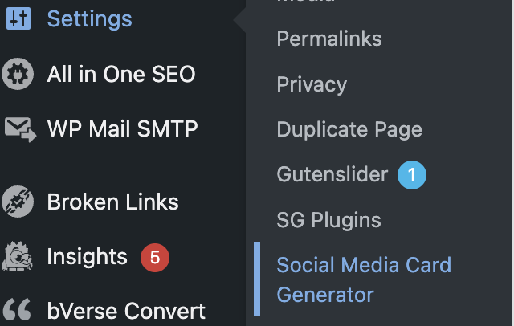
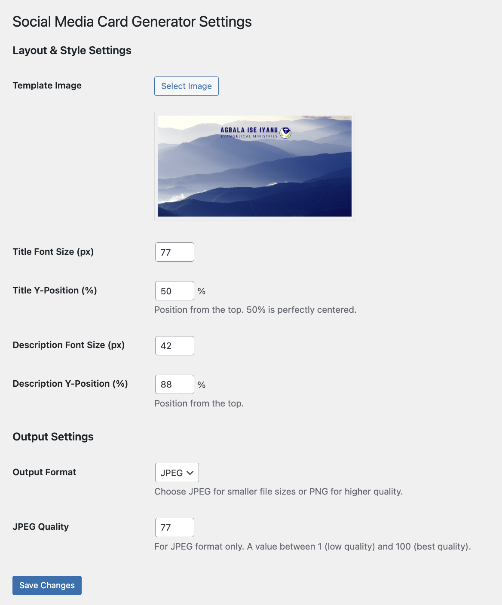
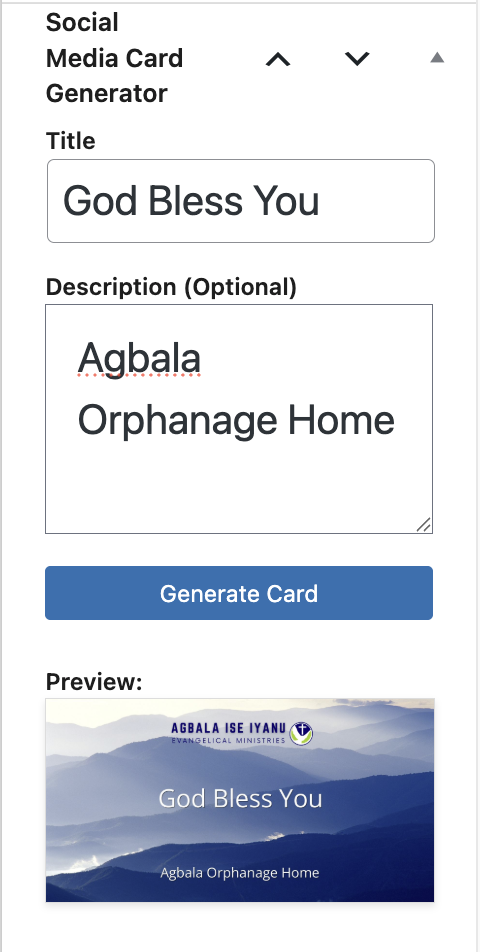

# Social Media Card Generator

*   **Contributors:** peal333
*   **Tags:** social media card, card generator, open graph, facebook card, twitter card
*   **Requires at least:** 5.0
*   **Tested up to:** 6.8
*   **Stable tag:** 1.4.1
*   **License:** GPLv2 or later
*   **License URI:** https://www.gnu.org/licenses/gpl-2.0.html
*   **GitHub Repository:** [https://github.com/peal333/social-media-card-generator](https://github.com/peal333/social-media-card-generator)

A WordPress plugin that allows users to easily create custom social media cards for posts directly from the post editor.

---

## Description

Social Media Card Generator adds a simple and intuitive interface to the WordPress post editor, enabling you to generate beautiful and engaging social media cards on the fly. Stop relying on whatever image social platforms decide to pull from your post. Instead, create a custom, branded image with your post's title and a short description overlaid, ensuring your content looks professional when shared on platforms like X (formerly Twitter), Facebook, and LinkedIn.

The plugin uses a template image that you provide, ensuring all your social cards maintain a consistent brand identity. You can customize font sizes, text positions, and output formats directly from the settings page.

### Key Features

*   **Seamless Integration:** Adds a "Social Media Card Generator" meta box directly to the post editor sidebar.
*   **Custom Templates:** Upload your own branded background image to use as a template.
*   **Dynamic Text:** Automatically populates the card with the post title and an optional custom description.
*   **Live Preview:** Generate and preview the social card without leaving the editor.
*   **Media Library Integration:** The generated card is automatically saved to your WordPress Media Library.
*   **Customizable Layout:** Adjust the font size and vertical position of the title and description.
*   **Flexible Output:** Choose between JPEG (for smaller file sizes) or PNG (for higher quality) output formats.
*   **Quality Control:** Set the compression quality for JPEG images.

---

## Installation

1.  Upload the `social-media-card-generator` folder to the `/wp-content/plugins/` directory.
2.  Activate the plugin through the 'Plugins' menu in WordPress.
3.  Go to **Settings > Social Media Card Generator** to configure the plugin.

---

## Usage

### 1. Configure the Settings

Before you start generating cards, you need to set up a template.

1.  Navigate to **Settings > Social Media Card Generator** in your WordPress dashboard.
2.  **Upload a Template Image:** Click "Select Image" to upload or choose a base image from your Media Library. This will be the background for all your generated cards. A size of **1200x630 pixels** is highly recommended for best results on social media.
3.  **Adjust Layout & Style:**
    *   Set the font sizes (in pixels) for the title and description.
    *   Set the vertical (Y-Position) for the title and description. This is a percentage from the top of the image (e.g., 50% is vertically centered).
4.  **Configure Output Settings:**
    *   Choose your desired **Output Format**: JPEG or PNG.
    *   If you select JPEG, you can set the **JPEG Quality** (1-100).
5.  Click **Save Changes**.

### 2. Generate a Card in the Post Editor

1.  Create a new post or edit an existing one.
2.  In the post editor sidebar, find the **Social Media Card Generator** meta box.
3.  The **Title** field will be pre-filled with your post's title. You can modify it here for the card if you wish.
4.  Optionally, add a short **Description**.
5.  Click the **Generate Card** button.
6.  A loading spinner will appear, and once finished, a preview of your new social card will be displayed in the meta box. The image is now saved to your Media Library.

**Note:** You must save your post as a draft at least once before you can generate a card.

---

## Screenshots

_1. The Social Media Card Generator settings page in the WordPress admin area._

_2. Configuring the template image, layout, and output settings._

_3. The generator meta box in the post editor with a live preview._

---

## Requirements

*   **PHP GD Library:** This plugin requires the GD library to be installed and enabled on your server for image processing. The plugin will display a warning in the admin dashboard if the GD library is not detected.
*   **Custom Font (Recommended):** For the best text rendering, the plugin is designed to use the Open Sans font. Please download `OpenSans-Regular.ttf` and place it in the following directory: `/wp-content/plugins/social-media-card-generator/fonts/`. If the font is not found, the plugin will attempt to use a common system font as a fallback.

---

## Contribute

This is an open-source project, and we welcome contributions. If you have a bug to report or a feature to request, please open an issue or submit a pull request on our official [GitHub repository](https://github.com/peal333/social-media-card-generator).