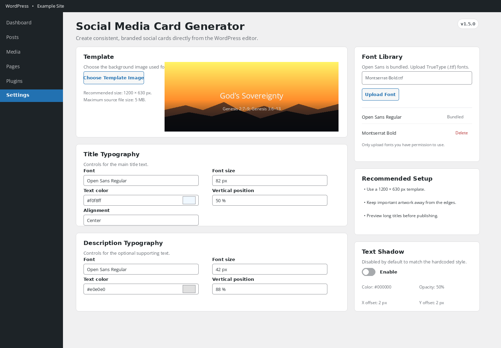
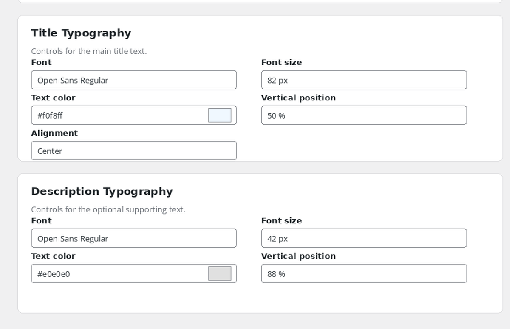
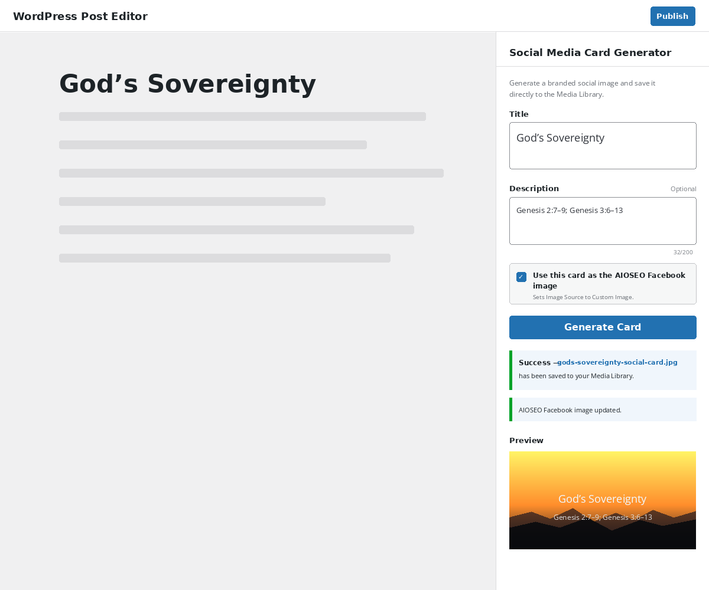

# Social Media Card Generator

Social Media Card Generator is a WordPress plugin for creating branded Open Graph/social sharing images directly from the post editor. Cards are rendered on your server with PHP GD and saved to the WordPress Media Library.

Version **1.5.3** adds WordPress 7.1-compatible post-title synchronization while preserving support for Classic Editor and older block-editor implementations.

## Quick start

1. Upload the `social-media-card-generator` folder to `/wp-content/plugins/`, or install the plugin ZIP from **Plugins > Add New > Upload Plugin**.
2. Activate **Social Media Card Generator**.
3. Go to **Settings > Social Media Card Generator**.
4. Choose a template image. A **1200 × 630 px** image is recommended.
5. Adjust the title, description, shadow, font, alignment, and output settings as needed.
6. Save the settings.
7. Edit a post and open the **Social Media Card Generator** panel.
8. Enter or adjust the card title and optional description, then click **Generate Card**.
9. After generation, the plugin confirms the saved filename and shows a preview. The new image is available in the Media Library.

> New posts need to be saved as a draft once before a card can be generated, because WordPress must have a post ID to attach the generated image to.

## Settings

### Template

Choose the background image that every card will use. The plugin accepts image formats supported by your server's GD installation. Template files are limited to 5 MB.

For social sharing, a 1200 × 630 px template is a good default because it matches the common 1.91:1 Open Graph image ratio.

### Title typography

The title has independent controls for:

- Font
- Font size
- Text color
- Vertical position
- Alignment: left, center, or right

The defaults reproduce the previous hardcoded design:

- Font: **Open Sans Regular**
- Font size: **82 px**
- Color: **#F0F8FF**
- Vertical position: **50%**
- Alignment: **Center**

### Description typography

The optional description has its own font, size, color, vertical position, and alignment controls. Its default color is **#E0E0E0**, matching the previous hardcoded version.

### Text shadow

Text shadow is **off by default**, matching the hardcoded version. If enabled, you can configure:

- Shadow color
- Opacity
- Horizontal offset
- Vertical offset

### Output

Cards can be saved as:

- **JPEG** — smaller files, with configurable quality
- **PNG** — lossless output

Generated files are registered as normal WordPress Media Library attachments and attached to the post that created them.

## Fonts

Open Sans Regular is bundled with the plugin and remains the default.

### Uploading a custom font

1. Go to **Settings > Social Media Card Generator**.
2. In **Font Library**, choose a `.ttf` file.
3. Click **Upload Font**.
4. After validation, the font will appear in both the Title and Description font selectors.
5. To return a title or description to the bundled default, click **Use Open Sans** beside that font selector and then click **Save Changes**.

Custom fonts are stored under:

```text
wp-content/uploads/social-media-card-generator/fonts/
```

The plugin does **not** enable arbitrary font uploads across the WordPress Media Library. Font uploads are restricted to administrators using the plugin settings page. The upload is checked for a `.ttf` extension, a TrueType/SFNT signature, and FreeType readability before WordPress moves it into the plugin's font directory. The plugin also scopes its MIME allowance to that authenticated upload request so other Media Library uploads are unaffected.

Only upload fonts that you are licensed or otherwise permitted to use. The bundled Open Sans font is distributed under the SIL Open Font License 1.1; its license is included in `fonts/OFL.txt`.

## AIOSEO integration

If a compatible, active version of **All in One SEO (AIOSEO)** is detected, the post editor shows an optional checkbox:

> **Use this as the AIOSEO Social Image**

When checked, a successful generation sets both the Facebook and Twitter/X image sources in AIOSEO to **Custom Image** and assigns the newly generated Media Library image to both social networks. For Twitter/X, the plugin disables AIOSEO's “Use Data from Facebook Tab” setting for that post so the Twitter custom-image fields are stored explicitly.

The checkbox is remembered as a **per-user preference**. Once you enable or disable it, that choice is used the next time you open the generator on another post. After a successful AIOSEO update, the plugin also synchronizes AIOSEO's live post-editor state so the Facebook and Twitter/X Custom Image fields on the current page reflect the new card without a page reload. If the image is created successfully but the AIOSEO update fails, the plugin reports those outcomes separately so the saved card is not mistaken for a failed generation.

AIOSEO is not required to use Social Media Card Generator.

## Screenshots

### Redesigned settings page



### Typography and font controls



### Post editor, success message, preview, and AIOSEO option



## Requirements

- WordPress 5.0 or later (tested through WordPress 7.1)
- PHP 7.0 or later
- PHP GD extension
- GD compiled with FreeType support (`imagettftext()` / `imagettfbbox()`)
- A writable WordPress uploads directory

WebP templates additionally require WebP support in the server's GD build.

## Troubleshooting

### The plugin says GD or FreeType is unavailable

Ask your hosting provider to enable PHP GD with FreeType support. The plugin cannot render TrueType text without those functions.

### A custom font will not upload

Make sure the file is a TrueType `.ttf` font, is no larger than 5 MB, and is readable by the server's GD/FreeType installation. Some servers report valid TTF files with different MIME strings; version 1.5.2 handles those differences inside the plugin's own upload request. Files that are actually OpenType/CFF or another format but merely renamed to `.ttf` are still rejected.

### The generated text is too close to an edge

Adjust the vertical position and alignment settings. The renderer keeps a 5% horizontal margin when using left or right alignment and wraps text within 90% of the image width.

### AIOSEO is installed but the checkbox does not appear

The integration appears only when AIOSEO is active and exposes the supported post-model API. If AIOSEO is installed but inactive, the plugin displays a notice instead. Update and activate AIOSEO before using the integration.

## Privacy and external services

Social Media Card Generator does not send card content, font files, analytics, or site data to an external service. Rendering happens locally on the WordPress server. The optional AIOSEO integration communicates only with the locally installed AIOSEO plugin.

## Development and WordPress.org notes

The plugin uses WordPress APIs for settings, nonces, capability checks, media attachments, admin assets, file uploads, sanitization, and escaping. Admin CSS and JavaScript are bundled locally; no third-party scripts or styles are loaded from a CDN.

For WordPress.org releases, copy the prepared banner, icon, and screenshot files into the repository's top-level SVN `assets/` directory rather than `trunk/`.

Development repository: <https://github.com/peal333/social-media-card-generator>

## Changelog

### 1.5.3

- Added iframe-safe card-title synchronization for WordPress 7.1 by reading the current edited post title from the `core/editor` WordPress data store.
- Kept the DOM-based title listener as a backwards-compatible fallback for Classic Editor and older editor implementations.
- Added `wp-data` as a post-editor-only script dependency.
- Updated WordPress compatibility metadata through 7.1.

### 1.5.2

- Restored the full **Social Media Card Generator** meta-box title and removed custom header spacing so WordPress core controls the header padding/margins consistently with other post boxes.
- Synced AIOSEO's live Vue/Pinia post-editor state after a successful social-image update so the current Facebook and Twitter/X fields refresh without a page reload.
- Fixed valid `.ttf` uploads being rejected by WordPress on servers whose `fileinfo` MIME result differs from `font/ttf`, while keeping the MIME allowance scoped to the plugin's authenticated font-upload request.
- Added TrueType signature and FreeType readability checks before a custom font is moved into the uploads directory.
- Added **Use Open Sans** controls beside the title and description font selectors.

### 1.5.1

- Shortened and refined the post-editor meta-box header for narrow WordPress sidebars.
- Fixed AIOSEO integration by updating its existing post model directly instead of sending an incomplete `savePost()` payload.
- Added AIOSEO Twitter/X custom-image support alongside Facebook.
- Added a per-user remembered AIOSEO social-image preference.
- Added post-save verification and AIOSEO cache invalidation after social-image updates.

### 1.5.0

- Added independent title and description font selection.
- Added administrator-only `.ttf` custom-font uploads stored in WordPress uploads.
- Added title and description color controls with defaults matching the hardcoded version.
- Added left, center, and right text alignment.
- Added optional configurable text shadow, disabled by default.
- Redesigned the plugin settings and post-editor interfaces.
- Added a Media Library success message with the generated filename.
- Fixed HTML entities showing in the generated-card title field.
- Added optional AIOSEO Facebook-image integration.
- Improved per-post capability checks, validation, sanitization, and output escaping.
- Added the Open Sans license and refreshed documentation/artwork.
- Removed development-only files from the distributable package.

### 1.4.2

- Initial public release.

## License

Social Media Card Generator is licensed under the GNU General Public License v2 or later.

The bundled Open Sans font has its own SIL Open Font License 1.1; see `fonts/OFL.txt`.
